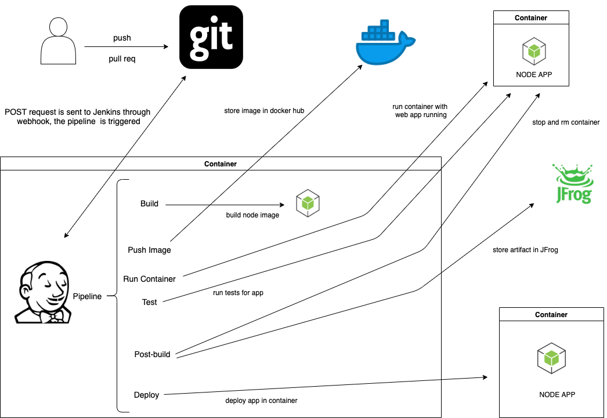

# Welcome to the the cookingWeb app

## Prerequisites

* You need to have a [GitHub](https://github.com/) account and a [DockerHub](https://www.docker.com/) account

## Deploy Jenkins Infrastructure

* Login in a AWS account.
* In CloudFormation, manually deploy `aws/cf-template.json`. This will create an EC2 instance for Jenkins. Docker and git will be already installed in the instance.
* In CloudFormation, manually deploy `aws/bootstrap-codebuild-jenkins.json`. This will create a CodeBuild job that will clone the git repo `https://github.com/diegofontecilla/cookingWeb.git` in the EC2 instance.

## Install node on EC2 instance (MAYBE NOT NECESSARY)

* Login your ec2 instance
* To set up node.js run:
  * `curl -o- https://raw.githubusercontent.com/nvm-sh/nvm/v0.34.0/install.sh | bash`
  * `. ~/.nvm/nvm.sh`
  * `nvm install node`
  * `node -e "console.log('Running Node.js ' + process.version)"`
  * general [documentation](https://docs.aws.amazon.com/sdk-for-javascript/v2/developer-guide/setting-up-node-on-ec2-instance.html)

## Build Jenkins image and deploy Jenkins in Docker container

* [ ] The following steps should be moved into the CodeBuild job
* log in on the ec2 instance, run `git clone https://github.com/diegofontecilla/cookingWeb.git`
* ls to root dir of repo: `cd cookingWeb/`
* build the image for Jenkins, run: `docker build -t fontecilla/myjenk .`
* run the container for Jenkins, run: `docker container run -d --name myjenkins -p 8080:8080 -v /var/run/docker.sock:/var/run/docker.sock fontecilla/myjenk:latest`

## Configure the `cookingapp` Jenkins job manually (EC2 INSTANCE)

* From AWS console, copy the public IPv4 address of your instance and paste it in a new browser (add `:8080` at the end)
* Create a user
* On the jenkins UI, click on the `cookingapp` job and then on `configure`
* Under General, check the box `GitHub project` and paste the url of the git repo `https://github.com/diegofontecilla/cookingWeb`
* Under `Build Triggers`, check `GitHub hook trigger for GITScm polling` and save
* Configure DockerHub credentials for Jenkins
  * Go to the `cookingapp`, `Configure`, `Pipeline`, on `Definition` choose `Pipeline script` and click `Pipeline Syntax`
  * On `Sample Step` choose `withCredentials: Bind credentials to variables`
    * on `Bindings` click `add` and choose `Secret text`
      * set up variable => `dockerHubPwd`
      * click `add` and choose `Jenkins`
      * on `Kind` select `Secret text`
      * under `Secret` paste your DockerHub password
      * id: `docker-pass-id`
      * description: `Docker hub password`

## Configure `webhooks` on GitHub to build the `cookingapp` job after updates (push) on repo

* on the GitHub repo, go to settings, webhooks and add a new webhook.
[instructions](https://embeddedartistry.com/blog/2017/12/21/jenkins-kick-off-a-ci-build-with-github-push-notifications/)
* when running jenkins container on localhost, follow this:
  * sign up on `ngrok` and follow instructions: `https://dashboard.ngrok.com/get-started`
  * on GitHub repo under settings/Webhooks, don't forget to add `/github-webhook/` at the
  end of the URL given
* you nedd to run the first build manually. then, each commit to `master` will trigger the
cookingapp job

## Pipeline stages flow

## TODO

* [ ] in the casc include dockerHub credentials
* [ ] In casc create Jenkins user. When deployed (Jenkins) it should login using that user automatically
* [ ] In the casc I need to specify a URL and stop using `ngrok`. Probably I need to create a load balancer and use that for the Jenkins URL in the casc, line 124. See how this is resolved in curly. Yes, that is correct, use load balancer name for the url in the casc.
* [ ] deploy Jenkins container with AWS ECS
* [ ] deploy ECS (cluster, job definition, service, etc) using Cloud Formation
* [ ] solve plugins update in Jenkins image. line is comment out
* [ ] create Jenkins ec2 image using [ec2 image buider](https://www.google.com/search?q=create+customized+ec2+instance+in+ec2+image+builder+on+aws&oq=create+customized+ec2+instance+in+ec2+image+builder+on+aws&aqs=chrome..69i57.20786j0j7&sourceid=chrome&ie=UTF-8#kpvalbx=_GzDBX8S8Ndyi1fAP156X0AI14)
* [ ] improve name of CF templates
* [ ] automate deployment of ec2 instance with ClodFormation. then move it to terraform
* [ ] automated installation of software required in ec2 instance (docker, git, node)
* [ ] automate creation of user for Jenkins with casc
* [ ] automate provision of DockerHub credentials for Jenkins
* [ ] run tests in an agent: 
  * the Jenkins server (ec2 instance) respond on a specif port
  * check that the website respond, front end test
* [ ] create agent for running `cookingapp` job
* [ ] in diagram, express that containers run in local machine, and docker, git and jfrog outside of it
* [ ] run tests in agent (thecookingwebapp container). I need to setup the agent. see [this](https://docs.microsoft.com/en-us/azure/devops/pipelines/agents/docker?view=azure-devops) and [this](https://devopscube.com/docker-containers-as-build-slaves-jenkins/)
* [ ] think in the design: how the new features are integrated in the cookingwebapp container
* [ ] give Jenkins permissions to run docker commands
* [ ] take out cypress (completely)
* [ ] deploy cookingwebapp to an ec2 instance using ssh agent plugin. [see this](https://www.youtube.com/watch?v=gdbA3vR2eDs) at minute 28
* [ ] update configuration-as-code:1.35 to latest
* [ ] modify diagram. the app container is outside Jenkins container. [read reference](https://medium.com/@manav503/how-to-build-docker-images-inside-a-jenkins-container-d59944102f30)
* [ ] update Docker version (docker installed inside Jenkins container) on Jenkins image
* [ ] on jenkins/plugins.txt, pin the nodejs plugin
* [ ] in the last step of the pipeline, save a artifact and store it in an artifact repo
* [ ] deploy Jenkins container using Fargate. see this:
  - [Deploy Docker Containers](https://aws.amazon.com/getting-started/hands-on/deploy-docker-containers/)
  - [Deploying on AWS Fargate using Cloudformation](https://medium.com/@anupam.ncsu/deploying-on-aws-fargate-using-cloudformation-3bf33cefbf18)
